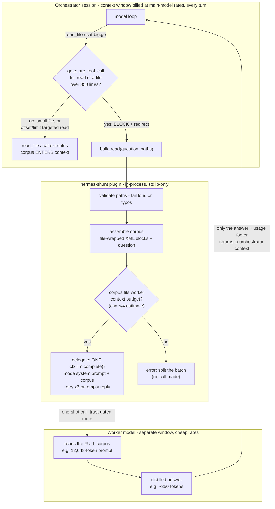
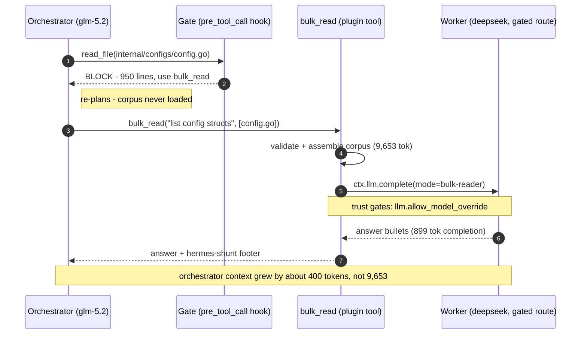
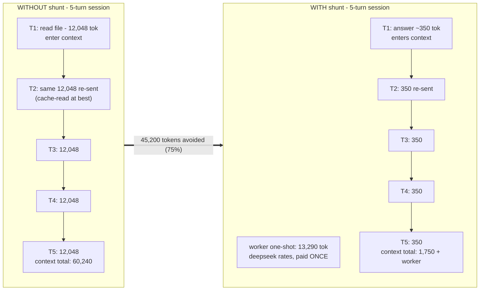

hermes-shunt
===========

Shunts I/O-heavy work (large file reads, boilerplate generation) to one-shot
worker LLM calls, so file corpora never enter the orchestrator's context.

Hermes port of Spotify's [shunt](https://github.com/spotify/portal-ai-plugins)
Claude Code plugin. Routing semantics, allow-rules, eval case matrix, and mode
instruction texts ported from upstream (Apache-2.0) — see NOTICE.

Status: v0.1.0. Hook + tools live; 89 tests green incl. upstream's 34-case eval matrix.

## How it works

Three layers, hard gate to soft guidance (same structure as upstream shunt,
rebuilt on Hermes plugin primitives):



**The mechanism in one sentence:** the file corpus goes to a *second LLM call
in its own context window*, and only the distilled answer crosses back — so
the orchestrator's context never grows by the size of the files, only by the
size of the answer.

A blocked read in practice:



### Why the savings are significant

Two effects stack:

1. **Context-window reduction (immediate).** A 602-line file is ~12,048
   tokens. Read directly, all of it enters the orchestrator's window; with
   shunt, ~350 tokens (the answer) enter. Measured: **91–97% per delegated
   read**.

2. **Compounding (the real win).** Context is re-sent on *every* subsequent
   turn of the session. A corpus read directly re-rides all remaining turns
   (at best billed as cache-reads); the distilled answer re-rides at ~350
   tokens instead. The worker call is one-shot, in a separate window, at
   cheap-worker rates:



The honest trade: single-shot *total* tokens are higher with shunt (the
worker re-receives the corpus as its prompt). Shunt optimizes the
orchestrator's context — the window that is expensive, rate-limited, and
re-billed every turn — and pays for it with one cheap one-shot call.
Non-goals by design: debugging, exact-content editing (use targeted
offset/limit reads — the gate always allows them), and architectural
judgment stay on the orchestrator.

## Install (development)

```bash
ln -s ~/hermes-shunt/plugin ~/.hermes/plugins/hermes-shunt
hermes plugins enable hermes-shunt
```

## Install (pinned, for third parties)

Treat this repo as untrusted third-party code — read SECURITY.md first.
Install a specific immutable commit, not a branch:

```bash
hermes plugins install trinaldirizki/hermes-shunt --ref <full-40-char-commit>
```

Hermes verifies `HEAD` exactly matches the requested SHA and records the
revision in your profile. Re-audit and re-pin on every update; never install
from a moving branch for org use.

## Configuration

| Variable | Default | Purpose |
|---|---|---|
| `SHUNT_MIN_LINES` | `350` | Line count above which full-file reads are blocked and redirected |
| `SHUNT_TIMEOUT_SECONDS` | `180` | Timeout for one delegation call |
| `SHUNT_MAX_CORPUS_TOKENS` | `100000` | Estimated-token guard (chars/4) on the assembled corpus — must fit the worker model's context window with answer headroom |
| `SHUNT_WORKER_MODEL` | unset → active model | Worker model (requires `plugins.entries.hermes-shunt.allow_model_override`) |
| `SHUNT_WORKER_PROVIDER` | unset → active provider | Worker provider (requires `allow_provider_override`) |
| `SHUNT_DISABLE_HOOK` | unset | `1` = kill-switch: disable blocking without uninstalling |

Worker-model routing (e.g. to a cheap model) additionally requires the trust
gates in `~/.hermes/config.yaml` (set via `hermes config set`, verified live):

```yaml
plugins:
  entries:
    hermes-shunt:
      llm:
        allow_provider_override: true
        allowed_providers: [deepseek]
        allow_model_override: true
        allowed_models: [deepseek-chat]
```

Without the gates, routing raises a fail-loud error naming the exact config
key (`Plugin 'hermes-shunt' cannot override the provider — set
plugins.entries.hermes-shunt.llm.allow_provider_override to true`). With the
gates + `SHUNT_WORKER_MODEL`/`SHUNT_WORKER_PROVIDER`, delegation bills to the
worker: verified live — stats recorded model `deepseek-flash` (DeepSeek's
current serving alias for the `deepseek-chat` endpoint), 9,319 prompt / 20
completion tokens.

## /shunt stats

In-session slash command (interactive CLI/TUI and gateway sessions —
one-shot `hermes chat -q` has no slash dispatch, so `/shunt` reaches the
model as plain text there):

```
/shunt stats
calls: 2 (bulk-reader:2)
worker tokens spent: 9,553
orchestrator tokens avoided: 17,672
```

## Benchmark

Measured on public corpora (upstream `websocket-handler.ts` fixture +
[trinaldirizki/devkit](https://github.com/trinaldirizki/devkit)), deepseek
worker — full method + numbers in
[docs/2026-09-12-canary-benchmark.md](docs/2026-09-12-canary-benchmark.md):

| Scenario | Context saved | Worker one-shot |
|---|---|---|
| Single large file (602 L) | 97% | 13,290 tok |
| Multi-file comprehension (4 files) | 91% | 8,707 tok |
| Code-write (pattern-following module) | generation offloaded | 3,593 tok |

Savings are context-window + multi-turn compounding (63–75% over a 5-turn
session), not single-call totals — see the report's "honest trade" section
and the "How it works" diagrams above.


## What does not get delegated

- Debugging — requires the orchestrator's reasoning, not a summary
- Editing — exact content must be in context; use targeted reads (offset/limit)
- Small files — delegation overhead exceeds savings under 350 lines
- Architectural decisions — judgment stays on the orchestrator

## License

Apache-2.0. Mode instruction texts and routing semantics ported from
spotify/portal-ai-plugins (Apache-2.0) — see NOTICE.

## v0.1.1 — cumulative gate (R2) + first-turn primer (R3)

- `SHUNT_CUMULATIVE_GATE` (default on; `0` disables): per-session tracking
  of targeted-read lines per file — further targeted reads block once prior
  cumulative reads exceed the threshold. Any single targeted read always
  passes (upstream semantics preserved; the ported eval matrix runs with it
  scoped off).
- First-turn `pre_llm_call` primer instructs delegation before the first
  big read, making `bulk_read` the default path (A/B measured 3/3 adoption,
  54–87ontext reduction vs un-shunted control on real multi-file tasks).
